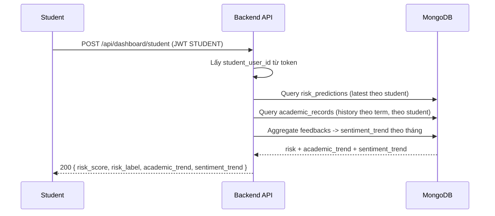
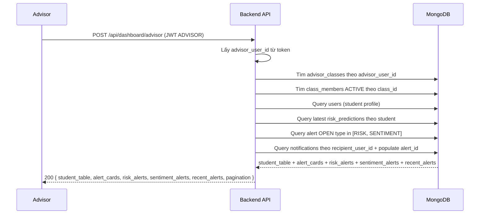

# Dashboard Flow (AI-01 + AI-02 + AI-04)

## 1) Scope
Tài liệu mô tả luồng dashboard hiện tại:
- `STUDENT`: chỉ xem dashboard của chính mình
- `ADVISOR`: chỉ xem dashboard của chính advisor đó
- Chủ đạo hiển thị `risk` và `sentiment`; anomaly dùng cho alert/summary tùy dashboard.

## 2) Student Dashboard Sequence

## 3) Advisor Dashboard Sequence

## 4) Payload chính
### 4.1 Student dashboard
- `risk_score`
- `risk_label`
- `academic_trend`
- `sentiment_trend`

Ghi chú:
- `academic_trend`: lịch sử học tập theo từng `term_id` (không phải log từng lần nhập trong cùng 1 kỳ).
- `sentiment_trend`: dữ liệu aggregate theo tháng và `sentiment_label`.

### 4.2 Advisor dashboard
- `student_table[]`
  - `student_user_id`, `student_code`, `full_name`, `email`
  - `risk_score`, `risk_label`
  - `alerts.negative_sentiment_30d` (số lượng `SENTIMENT` alert `OPEN` của SV)
  - `alerts.high_risk` (số lượng `RISK` alert `OPEN` của SV)
  - `alert_count` = `negative_sentiment_30d + high_risk`
- `alert_cards`
  - `risk_open`
  - `sentiment_open`
- `risk_alerts` (top 20, từ `alert` OPEN)
- `sentiment_alerts` (top 20, từ `alert` OPEN)
- `recent_alerts` (top 20, lọc theo `alert_id.alert_type` trong `notifications`)
- `pagination`

## 5) Rule quyền truy cập
- `/api/dashboard/student`: chỉ role `STUDENT`
- `/api/dashboard/advisor`: chỉ role `ADVISOR`
- Không cho override `student_user_id` hoặc `advisor_user_id` qua body
